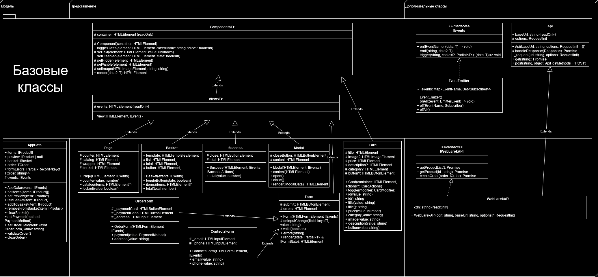

# Проектная работа "Веб-ларек"

Стек: HTML, SCSS, TS, Webpack

Структура проекта:
- src/ — исходные файлы проекта
- src/components/ — папка с JS компонентами
- src/components/base/ — папка с базовым кодом

Важные файлы:
- src/pages/index.html — HTML-файл главной страницы
- src/types/index.ts — файл с типами
- src/index.ts — точка входа приложения
- src/scss/styles.scss — корневой файл стилей
- src/utils/constants.ts — файл с константами
- src/utils/utils.ts — файл с утилитами

## Установка и запуск
Для установки и запуска проекта необходимо выполнить команды

```
npm install
npm run start
```

или

```
yarn
yarn start
```
## Сборка

```
npm run build
```

или

```
yarn build
```

## Архитектура



Используется паттерн MVP. Следовательно, код приложения разделен на три слоя:

- слой данных: отвечает за хранение и изменения данных

- слой представления: отвечает за вывод данных на страницу

- презентер: отвечает за взаимодействие данных и представления, описывая логику приложения (`src/index.ts`)

### Модель (данные)

#### Класс AppData

Отвечает за хранение данных и логику работы с ними. Хранит в себе:

- массив товаров

- товар, который открыт в данный момент

- объект корзины (товары в ней и их сумму)

- данные заказа

- данные валидации формы

- инстанс брокера событий (добавляется через конструктор)

С помощью методов, при изменении данных генерирует события через брокера.

### Представление

#### Класс Component

Базовый класс для будущих компонентов интерфейса. Является дженериком и принимает в переменной `T` тип данных, которые могут быть переданы в метод `render` для отображения. Хранит в себе ссылку на контейнер с элементом. Также содержит набор методов для модификации DOM-элементов.

В конструкторе принимает DOM-элемент.

#### Класс View

Базовый класс, расширяющий класс `Component`, добавляя в него поле `events`, в которое записывается брокер событий, чтобы была возможность их генерации. Также является дженериком и принимает в переменной `T` тип данных.

В конструкторе принимает DOM-элемент и брокер событий.

#### Класс Page

Реализует главную страницу - каталог товаров с счетчиком. Имеет набор сеттеров, отвечающих за DOM-элементы главной страницы. Генерирует событие `basket:open` при клике на кнопку корзины.

В конструкторе принимает DOM-элемент главной страницы и брокер событий.

#### Класс Modal

Реализует модальное окно. Предоставляет методы для управления состоянием окна и генерации событий (`modal:open`, `modal:close`).

В конструкторе принимает DOM-элемент модального окна на базе шаблона и брокер событий.

#### Класс Card

Реализует карточку товара (используется на главной, в модальном окне и в корзине). Реализует геттеры и сеттеры для различных полей карточки.

В конструкторе принимает DOM-элемент карточки на базе шаблона.

### Презентер

Отвечает за взаимодействие компонентов, находится в файле `index.ts`. Взаимодействие происходит за счет брокера событий, который их остлеживает.

TODO: описать все события в приложении после реализации функционала.

### Дополнительные (утилитарные) классы

#### Класс Api

Базовый класс для отправки и получения запросов. В конструктор передается базовый адрес сервера и опциональный объект с заголовками запросов.

В конструкторе принимает url сервера, по которому будут совершаться запросы и общие опции для этих запросов.

Методы:

- `get` - выполняет GET запрос на переданный в параметрах ендпоинт и возвращает промис с объектом, которым ответил сервер

- `post` - принимает объект с данными, которые будут переданы в JSON в теле запроса, и отправляет эти данные на ендпоинт переданный как параметр при вызове метода. По умолчанию выполняется 'POST' запрос, но метод запроса может быть переопределен заданием третьего параметра при вызове.

#### Класс EventEmitter

Классическая реализация брокера событий. Брокер событий реализует паттерн "Наблюдатель", позволяющий отправлять события и подписываться на события, происходящие в системе. Класс используется для связи слоя данных и представления.
Основные методы, реализуемые классом описаны интерфейсом `IEvents`:

- `on` - подписка на событие

- `emit` - инициализация события

- `trigger` - возвращает функцию, при вызове которой инициализируется требуемое в параметрах событие

В конструкторе принимает `Map`, состоящий из ивентов и подписчиков.

#### Класс WebLarekApi

Дополняет базовый класс `Api` методами работы с конкретным сервером проекта, а именно:

- `getProductList`

- `getProduct`

- `createOrder`

В конструкторе принимает url сервера с контентом, url сервера, по которому будут совершаться запросы, и общие опции для этих запросов.
